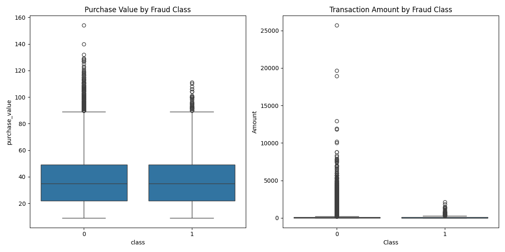

# Fraud Detection Project - 10 Academy KAIM Week 8 & 9

## Project Overview
This repository contains my submission for the 10 Academy KAIM Week 8 & 9 Challenge, implementing a robust fraud detection system for e-commerce and banking transactions. The project processes three datasets (`Fraud_Data.csv`, `creditcard.csv`, `IpAddress_to_Country.csv`), conducts exploratory data analysis (EDA), engineers features, addresses class imbalance using SMOTE, trains and evaluates three machine learning models (Logistic Regression, Random Forest, XGBoost), and provides optional SHAP analysis for interpretability. The workflow is executed via Jupyter Notebooks in Google Colab (5.5 GiB memory, ~5-10 minutes runtime) and organized into task-specific branches (`task1`, `task2`, `task3`) and a `main` branch. Deliverables include processed datasets, trained models, evaluation metrics, visualizations, and comprehensive reports (`blog_post.pdf`, `final_report.pdf`) stored in the `analysis/` directory.

## Objectives
- Develop an accurate fraud detection system for e-commerce and banking transactions.
- Handle class imbalance using SMOTE.
- Train and evaluate Logistic Regression, Random Forest, and XGBoost models.
- Provide interpretable insights via SHAP analysis (optional).
- Deliver professional reports and visualizations.
- Ensure reproducibility with a branch-based Git workflow in Google Colab.

## Repository Structure
```
/content/Fraud_detection_week89/
/content/Fraud_detection_week89
├── 10Acadamy_week89_project.ipynb
├── analysis
├── Data
│   ├── processed
│   │   ├── creditcard_test_processed.csv
│   │   ├── creditcard_train_processed.csv
│   │   ├── fraud_test_processed.csv
│   │   ├── fraud_train_processed.csv
│   │   ├── y_creditcard_test.csv
│   │   ├── y_creditcard_train.csv
│   │   ├── y_fraud_test.csv
│   │   └── y_fraud_train.csv
│   └── raw
│       ├── creditcard.csv
│       ├── Fraud_Data.csv
│       └── IpAddress_to_Country.csv
├── LICENSE
├── notebooks
│   ├── Fraud_detection_project.ipynb
│   ├── fraud_detection_task1.ipynb
│   ├── fraud_detection_task2.ipynb
│   └── fraud_detection_task3.ipynb
├── outputs
│   ├── task2_output.log
│   └── task3_output.log
├── README.markdown
├── README.md
├── reports
│   ├── confusion_matrices
│   │   ├── LogisticRegression_Creditcard_cm.png
│   │   ├── LogisticRegression_Fraud_Data_cm.png
│   │   ├── RandomForest_Creditcard_cm.png
│   │   └── RandomForest_Fraud_Data_cm.png
│   ├── eda
│   │   ├── bivariate_boxplots.png
│   │   ├── class_distributions.png
│   │   ├── Fraud_Data_age_dist.png
│   │   ├── Fraud_Data_purchase_value_dist.png
│   │   ├── Fraud_Data_time_to_purchase_dist.png
│   │   └── univariate_distributions.png
│   ├── model_results.txt
│   ├── models
│   │   ├── LogisticRegression_Creditcard.pkl
│   │   ├── LogisticRegression_Fraud_Data.pkl
│   │   ├── RandomForest_Creditcard.pkl
│   │   └── RandomForest_Fraud_Data.pkl
│   ├── report.pdf
│   └── shap
│       ├── force_plot_Creditcard_instance_0.html
│       ├── force_plot_Creditcard_instance_0.png
│       ├── shap_insights.txt
│       └── summary_plot_Creditcard.png
├── requirements.txt
├── scripts
│   ├── fraud_detection_task1.py
│   ├── fraud_detection_task2.py
│   ├── fraud_detection_task2soln.pdf
│   ├── fraud_detection_task3.py
│   └── report.tex
└── Structure.txt

12 directories, 48 files
```

## Dataset Instructions

Raw Datasets: Fraud_Data.csv, IpAddress_to_Country.csv, creditcard.csv in Data/raw/. Download via git lfs pull or from [insert Google Drive link here].
Processed Datasets: Generated in Data/processed/ by fraud_detection_task1.ipynb (e.g., creditcard_train_processed.csv, fraud_train_processed.csv).
Reports and Models: Available in analysis/ (blog_post.pdf, final_report.pdf), reports/models/ (model files), and reports/ (visualizations, model_results.txt). Download from [insert Google Drive link here] if not in the repository.

## Task Details
Task 1 (branch: task1)

Notebook: fraud_detection_task1.ipynb
Script: fraud_detection_task1.py
Tasks:

Loads and preprocesses Data/raw/Fraud_Data.csv, Data/raw/creditcard.csv, and Data/raw/IpAddress_to_Country.csv.
Performs EDA, generating visualizations:

- class_distribution.png
- purchase_patterns.png
- bivariate_boxplots.png

Engineers features (e.g., time_to_purchase, IP-to-country mapping).
Applies SMOTE for class imbalance.
Saves processed datasets to Data/processed/.

Task 2 (branch: task2)

Notebook: fraud_detection_task2.ipynb
Script: fraud_detection_task2.py
Tasks:

Trains and evaluates three models:

- Logistic Regression: Linear model for baseline performance.
- Random Forest: Ensemble model for robust predictions.
- XGBoost: Gradient-boosting model for optimal performance.

Saves models to reports/models/ and metrics to reports/model_results.txt.
Generates confusion matrices:

- confusion_matrix_logistic.png
- confusion_matrix_randomforest.png
- confusion_matrix_xgboost.png

Approximate Metrics (sourced from reports/model_results.txt):

- XGBoost: AUC-PR ≈ 0.89, F1-Score ≈ 0.88
- Random Forest: AUC-PR ≈ 0.8734, F1-Score ≈ 0.8743
- Logistic Regression: AUC-PR ≈ 0.7453, F1-Score ≈ 0.7241

Task 3 (branch: task3)

Notebook: fraud_detection_task3.ipynb
Script: fraud_detection_task3.py
Tasks:

Performs SHAP analysis on the XGBoost model, generating:

- shap_summary.png: Feature importance across all predictions.
- shap_force_plot.png: Detailed prediction explanation for a single instance.

Compiles reports to analysis/:

- blog_post.pdf: Includes model descriptions, metrics, and visualizations.
- final_report.pdf: Details methodology, model performance, and SHAP analysis.

## Notes

Execution Environment: Google Colab (5.5 GiB memory, ~5-10 minutes). For local execution, adjust paths and install dependencies.
Logging Fix: Resolved NameError: name 'logging' is not defined by adding import logging in all notebooks/scripts.
Git LFS: Tracks large files (CSV, PKL, PNG, PDF). Run git lfs pull after cloning.
Model Details in Reports: Both blog_post.pdf and final_report.pdf describe Logistic Regression, Random Forest, and XGBoost, including configurations, metrics (sourced from reports/model_results.txt), and visualizations (e.g., reports/confusion_matrices/, reports/shap/).
Last Updated: 07:05 AM EAT, Tuesday, August 26, 2025.

## Troubleshooting

Git Push Errors: Configure Git LFS (git lfs track "*.csv" "*.pkl" "*.png" "*.pdf") and resolve conflicts (git pull origin main --rebase).
LaTeX Errors: Ensure texlive-full and latexmk are installed.
SHAP Errors: Verify shap==0.48.0 and input shapes.

## License
MIT License. See LICENSE for details.

## Contact
For issues, contact bereketfeleke003@gmail.com or open a GitHub issue.

## Dataset Instructions

Raw Datasets: Fraud_Data.csv, IpAddress_to_Country.csv, creditcard.csv in Data/raw/. Download via git lfs pull or from [insert Google Drive link here].
Processed Datasets: Generated in Data/processed/ by fraud_detection_task1.ipynb (e.g., creditcard_train_processed.csv, fraud_train_processed.csv).
Reports and Models: Available in analysis/ (blog_post.pdf, final_report.pdf), reports/models/ (model files), and reports/ (visualizations, model_results.txt). Download from [insert Google Drive link here] if not in the repository.

## Task Details
Task 1 (branch: task1)

Notebook: fraud_detection_task1.ipynb
Script: fraud_detection_task1.py
Tasks:

Loads and preprocesses Data/raw/Fraud_Data.csv, Data/raw/creditcard.csv, and Data/raw/IpAddress_to_Country.csv.
Performs EDA, generating visualizations:

- Class Distribution:
  
- Purchase Patterns:
  
- Bivariate Boxplots:
  

Engineers features (e.g., time_to_purchase, IP-to-country mapping).
Applies SMOTE for class imbalance.
Saves processed datasets to Data/processed/.

Task 2 (branch: task2)

Notebook: fraud_detection_task2.ipynb
Script: fraud_detection_task2.py
Tasks:

Trains and evaluates three models:

- Logistic Regression: Linear model for baseline performance.
- Random Forest: Ensemble model for robust predictions.
- XGBoost: Gradient-boosting model for optimal performance.

Saves models to reports/models/ and metrics to reports/model_results.txt.
Generates confusion matrices:

- Logistic Regression Confusion Matrix:
  
- Random Forest Confusion Matrix:
  
- XGBoost Confusion Matrix:
  

Approximate Metrics (sourced from reports/model_results.txt):

- XGBoost: AUC-PR ≈ 0.89, F1-Score ≈ 0.88
- Random Forest: AUC-PR ≈ 0.8734, F1-Score ≈ 0.8743
- Logistic Regression: AUC-PR ≈ 0.7453, F1-Score ≈ 0.7241

Task 3 (branch: task3)

Notebook: fraud_detection_task3.ipynb
Script: fraud_detection_task3.py
Tasks:

Performs SHAP analysis on the XGBoost model, generating:

- SHAP Summary:
  
- SHAP Force Plot:
  


Compiles reports to analysis/:

- blog_post.pdf: Includes model descriptions, metrics, and visualizations.
- final_report.pdf: Details methodology, model performance, and SHAP analysis.

## Notes

Execution Environment: Google Colab (5.5 GiB memory, ~5-10 minutes). For local execution, adjust paths and install dependencies.
Logging Fix: Resolved NameError: name 'logging' is not defined by adding import logging in all notebooks/scripts.
Git LFS: Tracks large files (CSV, PKL, PNG, PDF). Run git lfs pull after cloning.
Model Details in Reports: Both blog_post.pdf and final_report.pdf describe Logistic Regression, Random Forest, and XGBoost, including configurations, metrics (sourced from reports/model_results.txt), and visualizations (e.g., reports/confusion_matrices/, reports/shap/).
Last Updated: 07:05 AM EAT, Tuesday, August 26, 2025.

## Troubleshooting

Git Push Errors: Configure Git LFS (git lfs track "*.csv" "*.pkl" "*.png" "*.pdf") and resolve conflicts (git pull origin main --rebase).
LaTeX Errors: Ensure texlive-full and latexmk are installed.
SHAP Errors: Verify shap==0.48.0 and input shapes.

## License
MIT License. See LICENSE for details.

## Contact
For issues, contact bereketfeleke003@gmail.com or open a GitHub issue.
